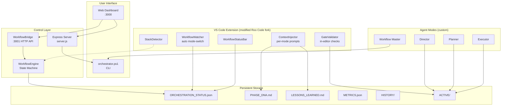

# Roo Workflow

> A multi-agent orchestration framework that turns [Roo Code](https://github.com/RooCodeInc/Roo-Code) into a structured **software factory**: enforced state machine, persistent memory, quality gates, and full autopilot.

[](docs/changelog.md)
[](LICENSE)
[](https://github.com/PowerShell/PowerShell)
[](https://nodejs.org/)

---

## What this is

Roo Workflow wraps an AI coding agent (a customised Roo Code VS Code extension) in a **strict 8-step state machine** with three specialised personas:

- **Director** — writes high-level phase plans, reviews work, owns long-term memory. Never writes code.
- **Planner** — turns the phase plan into a step-by-step technical plan. Never writes code.
- **Executor** — implements the approved plan exactly. Runs tests after every change.
- **Workflow Master** — autonomous mode that shape-shifts into all three based on current state.

Each transition is **gated** by content checks on machine-readable deliverables, snapshotted to git, and recorded for analytics. A 5-strike retry limit prevents runaway loops, and an Apache-2.0–licensed [fork of Roo Code](roo-code-fork/) provides in-editor automation (auto mode-switching, status bar, context injection).

```
INIT  →  PHASE_PLANNING  →  DETAILED_PLANNING  →  PLAN_REVIEW  →  EXECUTION  →  EXECUTION_REVIEW  →  ARCHIVE  →  COMPLETE
                                       ↑ NEEDS_REVISION                              ↑ NEEDS_REVISION
```

---

## Quick start (5 minutes)

### Prerequisites

| Tool | Minimum | Why |
|---|---|---|
| **PowerShell** | 7.0+ | Orchestrator engine. PS 5.1 also works on Windows but PS 7 is recommended. |
| **Node.js** | 18+ | Dashboard server. |
| **Git** | any | Auto-commit at every state transition. Optional but strongly recommended. |
| **VS Code** | latest | Host for the Roo Code extension. |
| **pnpm** | 10+ | Only if rebuilding the Roo Code VSIX from source. |

### 1. Clone and bootstrap

```powershell
git clone https://github.com/<your-username>/roo-workflow.git
cd roo-workflow
.\setup.ps1
```

`setup.ps1` runs `init-workflow.ps1` (which scaffolds the `WORKFLOW/` directory, agent rules, and modes) and installs dashboard dependencies.

### 2. Install the modified Roo Code extension

A pre-built VSIX may live in `roo-code-fork/bin/`. If not (recommended for security), build it yourself:

```powershell
cd roo-code-fork
pnpm install
pnpm install:vsix --editor=code
```

Or manually: VS Code → `Ctrl+Shift+P` → **Extensions: Install from VSIX…** → pick `roo-code-fork/bin/*.vsix`.

### 3. Start the dashboard

```powershell
cd workflow-dashboard
npm start
```

Open **http://localhost:3000**. You'll see the 8-step pipeline, action buttons, autopilot toggle, live console, and gate history.

### 4. Run a cycle

Either:

- **Autopilot** — Toggle Autopilot **ON** in the dashboard, switch to *Workflow Master* mode in Roo Code, give it a feature request. It will run end-to-end.
- **Manual** — Click **Next Phase** in the dashboard, switch to the indicated mode in Roo Code, complete the deliverable, click Next Phase again.

---

## Architecture



### File ownership

| File | Written by | Read by |
|---|---|---|
| `WORKFLOW/ORCHESTRATION_STATUS.json` | orchestrator.ps1, WorkflowEngine | Dashboard, WorkflowWatcher, WorkflowStatusBar |
| `WORKFLOW/ACTIVE/PHASE_PLAN.md` | Director | Planner, orchestrator |
| `WORKFLOW/ACTIVE/DETAILED_PLAN.md` | Planner | Director, orchestrator |
| `WORKFLOW/ACTIVE/PLAN_APPROVED.md` | Director | Executor |
| `WORKFLOW/ACTIVE/EXECUTION_REPORT.md` | Executor | Director, orchestrator |
| `WORKFLOW/ACTIVE/EXECUTION_DIFF.diff` | orchestrator.ps1 (git) | Director |
| `WORKFLOW/LESSONS_LEARNED.md` | Director (via reviews) | All modes |
| `WORKFLOW/PHASE_DNA.md` | Director, orchestrator (auto-snapshot) | All modes |
| `WORKFLOW/METRICS.json` | orchestrator.ps1 | Dashboard |
| `WORKFLOW/QUALITY_DASHBOARD.md` | orchestrator.ps1 | Dashboard |

---

## Repository layout

```
roo-workflow/
├── README.md                # this file
├── LICENSE                  # Apache 2.0
├── NOTICE                   # attribution + modification notice
├── .gitignore               # excludes WORKFLOW/, node_modules, build artifacts
│
├── orchestrator.ps1         # state machine engine (~1850 LOC)
├── init-workflow.ps1        # bootstrap script — run once per project
├── setup.ps1                # one-shot wrapper: init + npm install
│
├── workflow-dashboard/      # Express + SSE web UI
│   ├── server.js
│   ├── package.json
│   └── public/
│       ├── index.html
│       ├── styles.css
│       └── app.js
│
├── roo-code-fork/           # Apache-2.0 Roo Code with workflow integration
│   ├── src/workflow/        # ALL custom code lives here (isolated namespace)
│   │   ├── index.ts                # entry point + activation hook
│   │   ├── WorkflowWatcher.ts      # JSON state watcher → mode switch
│   │   ├── WorkflowStatusBar.ts    # status bar widget
│   │   ├── ContextInjector.ts      # per-mode prompt injection
│   │   ├── GateValidator.ts        # in-editor gate checks
│   │   ├── WorkflowEngine.ts       # in-process orchestrator (TS twin)
│   │   ├── WorkflowBridge.ts       # :3001 HTTP API for the dashboard
│   │   ├── StackDetector.ts        # auto-detect tech stack
│   │   └── DashboardPanel.ts       # webview wrapper
│   └── src/extension.ts     # one-line hook: activateWorkflowIntegration()
│
├── docs/
│   ├── architecture.md
│   ├── getting-started.md
│   ├── configuration.md
│   ├── troubleshooting.md
│   └── changelog.md
│
└── plans/                   # historical improvement plans (reference)
```

---

## Orchestrator commands

| Command | Purpose |
|---|---|
| `.\orchestrator.ps1 -Status` | Show current state, cycle ID, transitions, retries |
| `.\orchestrator.ps1 -Next` | Advance to next state (validates quality gates) |
| `.\orchestrator.ps1 -Undo` | Roll back to previous state, optionally restore file snapshots |
| `.\orchestrator.ps1 -Reset` | Reset to INIT, clean ACTIVE/ and SNAPSHOTS/ |
| `.\orchestrator.ps1 -Resume` | Reset RetryCount to 0 and re-enter EXECUTION (after manual fix) |
| `.\orchestrator.ps1 -Plan` | Interactive plan wizard with stack auto-detection |
| `.\orchestrator.ps1 -InjectPlan <path>` | Bypass planning, jump straight to EXECUTION |
| `.\orchestrator.ps1 -Interactive` | REPL mode |
| `.\orchestrator.ps1 -SkipGit` | Skip auto-commit for this transition only |

---

## Key features

### Persistent memory

- **`PHASE_DNA.md`** — current architecture truth: active models, dependencies, conventions, technical debt. Auto-snapshots stack versions on each ARCHIVE.
- **`LESSONS_LEARNED.md`** — graduated encyclopedia of bugs and gotchas. Lessons are tagged (`[LARAVEL]`, `[FLUTTER]`, `[GENERAL]`) so each agent filters to relevant ones.

### Quality gates

Every transition is validated against content rules. A plan that lacks `## Files to Modify` won't transition. An execution report missing `## Tests Run` won't transition. The orchestrator literally throws and the agent must fix it.

### Snapshots & undo

Before EXECUTION, every file in the approved plan is snapshotted with a manifest preserving original paths. `-Undo` can restore them — to the right directories, even after deeply-nested changes. Snapshots are tagged with `cycleId` so multi-cycle work doesn't cross-contaminate.

### 5-strike enforcement (hard)

Two attempts per bug, five total per phase. On the fifth failure the orchestrator writes `ESCALATION.md`, marks the workflow `BLOCKED`, fires a webhook, and refuses to advance until you investigate. No more runaway loops.

### Git integration

Every successful transition creates a commit (`chore(workflow): [STATE → STATE]`) and a tag (`workflow/{timestamp}/{state}`). Every cycle has a unique 8-char `cycleId` you can `git log --grep` for.

### Webhooks

Set `$env:ROO_WEBHOOK_URL` to a Slack/Discord/generic webhook URL — you'll get notifications on COMPLETE and BLOCKED.

### Real metrics

`METRICS.json` records per-cycle: duration, transitions, retries, **actual** files-modified count (from `git diff --stat`), gate-pass/fail history, escalation flag.

---

## The Roo Code fork

[`roo-code-fork/`](roo-code-fork/) is a derivative of [RooCodeInc/Roo-Code](https://github.com/RooCodeInc/Roo-Code) (Apache 2.0). All custom code lives in [`roo-code-fork/src/workflow/`](roo-code-fork/src/workflow/) — a single isolated directory — with one 9-line activation block added to `src/extension.ts`. This minimises upstream merge conflicts.

What the fork adds inside VS Code:

- **WorkflowWatcher** — `fs.watch` on `ORCHESTRATION_STATUS.json`, auto-switches Roo Code's mode (Director/Planner/Executor) on every transition.
- **WorkflowStatusBar** — current state, retry count, autopilot status, elapsed time. Red on `BLOCKED`.
- **ContextInjector** — auto-injects the right context files into the system prompt based on the current mode (Director gets DNA + lessons; Executor gets PLAN_APPROVED).
- **GateValidator** — `roo-code.checkWorkflowGate` command + webview that visualises gate failures.
- **WorkflowEngine + Bridge + Dashboard panel** — an in-process AI orchestrator with its own HTTP API on `:3001` and a VS Code webview hosting the dashboard.

To rebuild the VSIX:

```powershell
cd roo-code-fork
pnpm install
pnpm install:vsix --editor=code
```

---

## Configuration

`WORKFLOW/workflow-config.json` (created by `init-workflow.ps1`):

```json
{
  "tokenBudgets":      { "planning": 150000, "execution": 500000, "review": 100000 },
  "contextSizeLimits": { "maxFileSizeBytes": 51200, "maxContextTotalBytes": 524288 },
  "pollingRateMs":     1000,
  "autopilotSettings": { "allowFullAutonomy": false }
}
```

Environment variables:

| Variable | Purpose |
|---|---|
| `ROO_WEBHOOK_URL` | Slack/Discord/generic webhook for COMPLETE and BLOCKED events |
| `PORT` | Override dashboard port (default 3000) |
| `HOST` | Override dashboard bind host (default `127.0.0.1`) |

See [docs/configuration.md](docs/configuration.md) for the full reference.

---

## Troubleshooting

| Symptom | Fix |
|---|---|
| `ORCHESTRATION_STATUS.json not found` | Run `.\init-workflow.ps1` from the project root. |
| `Quality Gate N FAILED: missing required sections: X` | Add the missing `## X` section to the file named in the error. |
| Dashboard shows no data | Make sure `npm start` is running in `workflow-dashboard/`, then refresh. |
| Autopilot doesn't auto-advance | Verify *Always approve terminal commands* is enabled in Roo Code settings. |
| Workflow stuck at `BLOCKED` (5-strike) | Read `WORKFLOW/ACTIVE/ESCALATION.md`, fix root cause manually, run `.\orchestrator.ps1 -Resume`. |
| Webhook not sending | Confirm `$env:ROO_WEBHOOK_URL` is set in the same terminal session. |
| `Another orchestrator instance is running` | Stale lock — file is auto-cleaned after 60 s, or delete `WORKFLOW/.lock` manually if you're sure no other process is running. |

More: [docs/troubleshooting.md](docs/troubleshooting.md).

---

## Security model

The dashboard binds to `127.0.0.1` only and CORS is locked to localhost origins. Cross-origin POSTs return `403`. The `/api/inject-plan` endpoint validates the filename against `^[A-Za-z0-9._-]+\.md$` and confirms the resolved path stays inside `WORKFLOW/ACTIVE/`. The dashboard also coordinates with the orchestrator's file lock when toggling autopilot, so simultaneous toggle + `-Next` won't corrupt state.

If you want to expose the dashboard to your LAN, set `HOST=0.0.0.0` — but understand that anyone on your network will then be able to trigger orchestrator commands. Consider putting it behind an authenticated reverse proxy.

---

## Contributing

Issues and PRs welcome. The orchestrator and the dashboard have no automated test suite yet — the easiest way to validate a change is to run a full cycle locally and watch `WORKFLOW/orchestrator.log`.

If you're touching `roo-code-fork/src/workflow/` (the integration layer), keep all code inside that directory so upstream sync stays painless.

---

## License

This project is dual-natured:

- The orchestrator, dashboard, init scripts, and documentation are **MIT-licensed** unless otherwise noted.
- The `roo-code-fork/` directory is a derivative of Roo Code and remains under **Apache 2.0** as required by the original license.

The combined repository ships under **Apache 2.0** to remain compatible with the fork. See [LICENSE](LICENSE) and [NOTICE](NOTICE).

Original Roo Code © Roo Veterinary, Inc. and contributors. Workflow integration and orchestration code in `src/workflow/` and at the repo root © the respective contributors.

---

## Acknowledgements

- [Roo Code](https://github.com/RooCodeInc/Roo-Code) — the upstream VS Code extension this fork builds on.
- The Director / Planner / Executor pattern echoes the well-known three-role agent decomposition.
