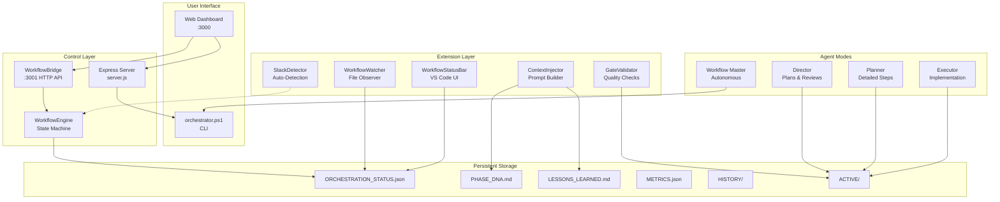

# Roo Code Workflow — Architecture

## System Overview

The Roo Code Workflow system is a multi-agent orchestration engine that enforces a structured development pipeline with quality gates, persistent memory, and autonomous capabilities.



## Data Flow

### State Transitions
```
INIT → PHASE_PLANNING → DETAILED_PLANNING → PLAN_REVIEW → EXECUTION → EXECUTION_REVIEW → ARCHIVE → COMPLETE
                              ↑ (NEEDS_REVISION)                           ↑ (NEEDS_REVISION)
```

### Port Allocation
| Port | Service | Purpose |
|------|---------|---------|
| 3000 | Express Dashboard | Web UI for monitoring |
| 3001 | WorkflowBridge | Extension ↔ Dashboard API |

### File Ownership
| File | Written By | Read By |
|------|-----------|---------|
| `ORCHESTRATION_STATUS.json` | orchestrator.ps1, WorkflowEngine | Dashboard, Watcher, StatusBar |
| `PHASE_PLAN.md` | Director | Planner, orchestrator |
| `DETAILED_PLAN.md` | Planner | Director, orchestrator |
| `PLAN_APPROVED.md` | Director | Executor |
| `EXECUTION_REPORT.md` | Executor | Director, orchestrator |
| `LESSONS_LEARNED.md` | Director | All modes |
| `PHASE_DNA.md` | Director, orchestrator | All modes |
| `METRICS.json` | orchestrator.ps1 | Dashboard |
